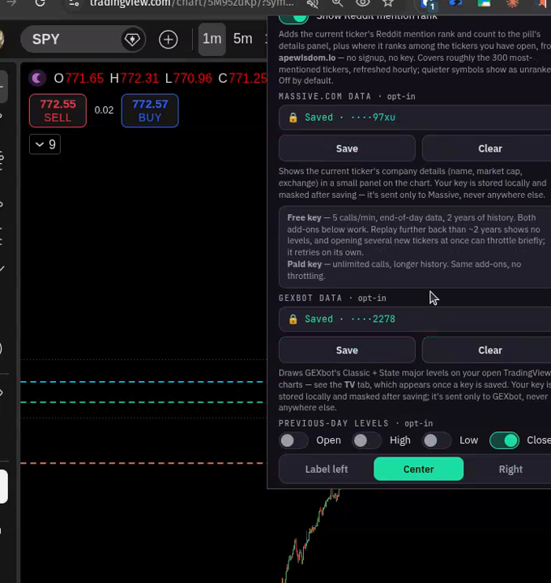
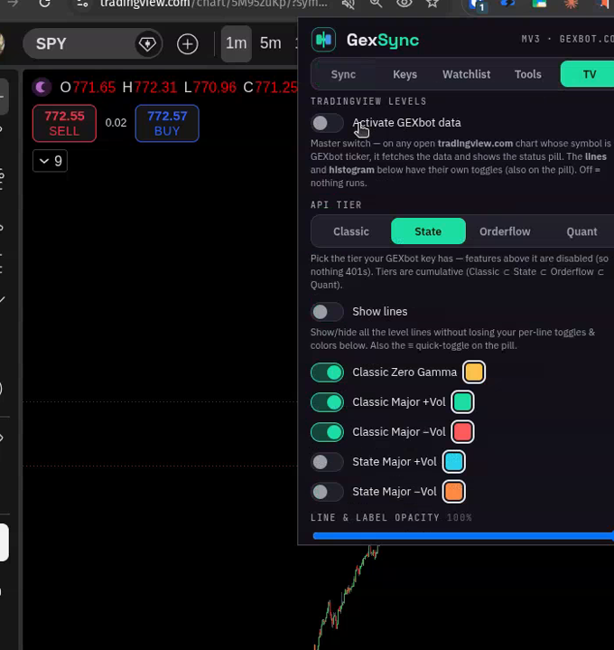
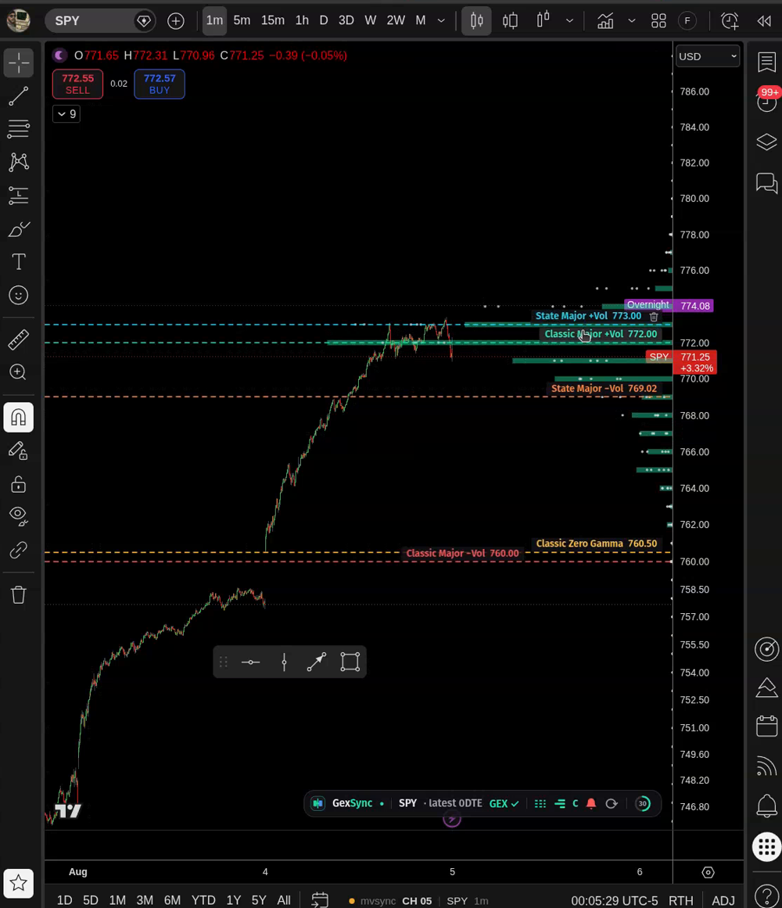

# GEXbot levels on TradingView

> 🇪🇸 **En español:** [Niveles de GEXbot en TradingView](es/tradingview.md).

New in **1.16**. Enter your GEXbot API key and any open **`tradingview.com/chart`** whose
symbol is a GEXbot ticker gets GEXbot's **Classic + State major levels** drawn right onto it —
plus an optional per-strike **GEX histogram** and **click-a-level → price alert**. Three steps.

## What you need

- **GexSync 1.16 or newer** installed ([Install](install.md)).
- **A GEXbot API key.** You get one from your GEXbot account: **subscribe to a plan** (Classic
  tier or above), then generate the key under **Account → API Key** on
  [gexbot.com](https://www.gexbot.com). API reference: **<https://www.gexbot.com/apidocs>**.
  Your **tier** decides what unlocks — the tiers are cumulative: **Classic ⊂ State ⊂ Orderflow ⊂ Quant**.

## Setup

### 1 · Paste your GEXbot key

Open the GexSync popup → **Keys** tab → **GEXbot Data** → paste your key → **Save**.
It's stored locally, masked after saving, and only ever sent to GEXbot.

### 2 · Turn the overlay on

Saving a key reveals a new **TV** tab. Open it, flip **Activate GEXbot data** on, and pick the
**API tier your key has** (anything above your tier stays disabled, so nothing errors out).

### 3 · Open a chart

Open a **`tradingview.com/chart`** on a GEXbot ticker (SPY, QQQ, SPX, …). The levels draw on the
chart and a **GexSync pill** appears at the bottom with a live refresh countdown. Done.

## Once it's on

Everything below lives in the **TV** tab (or as quick-toggles on the pill):

- **Levels** — toggle each one and set its color; a **Show lines** master switch.
- **GEX histogram** — per-strike profile bars down the side (Classic / State).
- **Packages** — **Latest / Next / 90-Day** (or click the pill to cycle).
- **Alerts** — **click a level to create a TradingView price alert** (one, or all at once).
- **Opacity** and **refresh rate** (1–60s).

## Notes

- Only draws on `tradingview.com/chart` pages whose symbol is a GEXbot ticker.
- The key never leaves your machine except to talk to GEXbot's API — see [Safety](safety.md).
